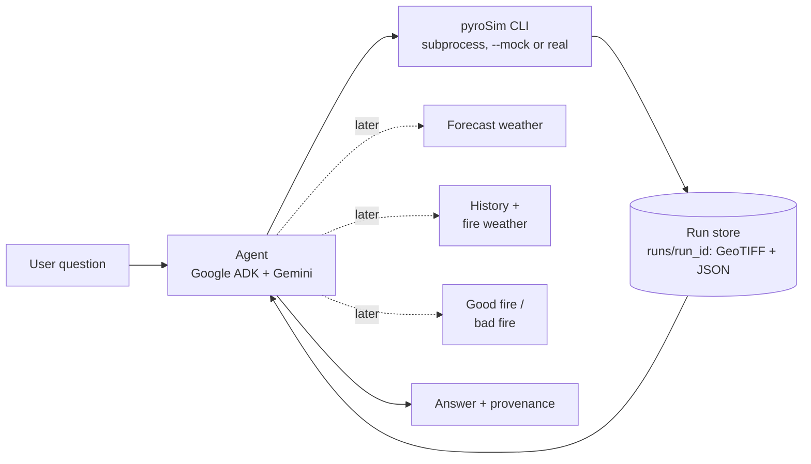
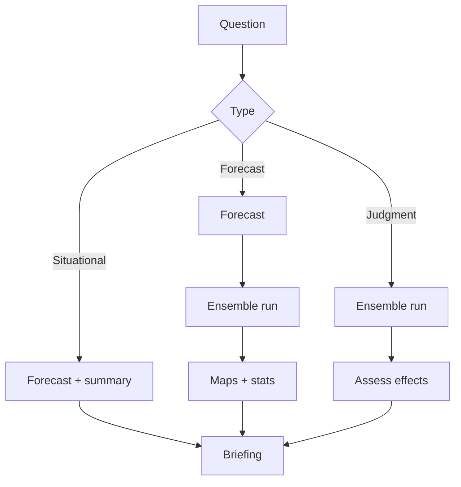

# Fire weather agent — system design

2026-09-17 · @Someone

## What we are building

An agent you ask fire questions in natural language, for a chosen area, that answers with a probability-weighted picture and the reasoning behind it.

Primary user: the duty officer or incident planner deciding the response to a new fire in its first 24–48 hours. That person chooses between full suppression and a managed strategy, and where to commit crews — exactly the question our three outputs answer together: where it goes, how intense it gets, and whether burning there helps or hurts. Secondary users are the fuels or prescribed-fire planner asking the same questions about a planned burn window, and an analyst doing after-action review.

Demo promise, one sentence: ask what a fire would do here over the next two days, and get a burn-probability map, an hour-by-hour risk window, a good-fire/bad-fire read, and a short briefing — validated against three real 2024 California fires.

Three question types the agent must handle:

1. Forecast — "if a fire starts near Trabuco Canyon at 1 PM tomorrow, where does it go by evening?"
2. Situational — "how bad is the fire weather here over the next 48 hours, and when is the critical window?"
3. Judgment — "would a fire here right now be good fire or bad fire, and what would change that answer?"

Non-goals: an operational product, suppression-aware simulation, or any claim that we forecast better than existing systems. My scope is the agent and the UI that binds the four workstreams together.

## System overview

Four workstreams feed one agent. Each is a service with a contract; the agent is the only thing that talks to all four.

| Workstream | Owner | Produces | Agent calls it for |
| --- | --- | --- | --- |
| Simulation (pyroSim CLI) | Sim owner | `pyroSim run` → hours-before-burn GeoTIFF + summary JSON (today); flame length, intensity, burn probability (later) | "where does fire go" |
| Fire history + fire weather | History owner | Past perimeters by day, weather at the time, observed spread rates | priors, analogs, validation targets |
| Good fire / bad fire readiness | Effects owner | Score per cell or area: ecological benefit vs. damage, given predicted behavior | "is this good fire" |
| Agent + UI | Me | Tool orchestration, chat, map, briefings, run records | everything |



Solid arrows exist today (Phase 0). Dotted arrows are the remaining workstreams.

The agent never computes fire behavior itself. It resolves the area and time, gathers weather, decides how many simulations to run, and turns the outputs into an answer.

## Interface contracts

Agree these in hour one; everything else can change. Each team writes to its contract and we integrate late without merge pain.

**Shared conventions.** Coordinates are lon/lat EPSG:4326 for requests *and* for today's rasters (the CLI writes EPSG:4326; the LANDFIRE 30 m Albers grid is a later option). Dates are `YYYY-MM-DD`; any text shown to a user uses local Pacific time. Wind speed km/h at 10 m, direction degrees the wind comes from, moistures as fractions (0.05 = 5%).

**1. Simulation: the pyroSim CLI (sim owner → me).** The contract is the command line, not an HTTP service. One call is one deterministic run, executed synchronously.

```bash
pyroSim run \
  --aoi-bounds -120.55 39.00 -120.30 39.20 \   # west south east north (lon/lat)
  --ignition-lonlat -120.45 39.10 \            # must be inside the AOI
  --ignition-date 2024-08-15 \                 # YYYY-MM-DD
  --projection-days 2 \                        # whole days, >= 1
  --weather-source gridmet \                   # gridmet | weathernext
  --output-name runs/run_x/hours_before_burn.tif \
  --summary-json runs/run_x/summary.json \     # machine-readable result (added for the agent)
  --mock                                       # synthetic spread, no Earth Engine (added for Phase 0)
```

`python -m firesim run ...` is equivalent and needs no install. Earth Engine auth comes from `EE_PROJECT` in the repo `.env`.

Outputs:

- **GeoTIFF**: one float32 band `hours_before_burn`, EPSG:4326, deflate. Value = hours from ignition until the cell burns; `0` at the ignition cell; nodata `-999` for cells that never burn, including masked water.
- **Summary JSON** (`--summary-json`), from a real run:

```json
{ "output": "runs/run_x/hours_before_burn.tif",
  "mock": false,
  "scenario": {"aoi_bounds": [-120.55, 39.0, -120.3, 39.2], "ignition_lonlat": [-120.45, 39.1],
               "ignition_date": "2024-08-15", "projection_days": 2, "weather_source": "gridmet"},
  "weather_source_used": "gridmet",
  "stats": {"burned_cells": 99, "burned_hectares": 189.0, "burned_acres": 467.1,
            "max_flame_length_m": 0.43, "mean_spread_rate_m_min": 0.41,
            "stop_condition": "max duration reached", "cell_size_m": 138.2},
  "grid": {"crs": "EPSG:4326", "shape": [162, 203], "cell_size_m": 138.2,
           "nodata": -999.0, "band": "hours_before_burn"} }
```

- **Exit codes**: `0` success. `2` invalid input, with a one-line `pyroSim: error: ...` on stderr (e.g. ignition outside the AOI). Any other non-zero code is a failed run; the agent surfaces stderr.

`weather_source_used` can differ from the request: `weathernext` falls back to `gridmet` when no forecast covers the date. **Mock mode** keeps the same arguments and outputs, writes `"mock": true` and `weather_source_used: "mock (...)"`, and produces a seeded wind-driven ellipse. It is test data, not fire behavior.

**What the CLI does not do yet, compared with the original `/run` contract.** These are the gaps to close in Phase 2; until then the agent only offers what the CLI supports.

| Original contract | CLI today | Consequence for the agent |
| --- | --- | --- |
| `start_time` with hour and offset | `--ignition-date` only; gridmet runs start 12:00 UTC | Can't ask "starts at 1 PM tomorrow"; say the fixed start |
| `duration_hours` | `--projection-days`, whole days | Growth is reported at checkpoint hours inside the horizon |
| Caller-supplied hourly `weather` | Weather fetched inside the CLI from `--weather-source` | No what-if wind or moisture yet (e.g. "30% stronger wind") |
| `seed`, ensembles, burn probability | One deterministic run; no variation arguments | What-ifs are separate runs varying date, horizon, ignition or weather source, compared with `compare_runs`; no probability maps yet |
| Rasters: arrival time, flame length, intensity, fire type | One raster: hours before burn; flame length and spread rate only as summary stats | Maps of flame-length bands aren't possible yet |
| 30 m LANDFIRE Albers grid | EPSG:4326 grid sized by `max_pixels=160` (about 138 m cells and 162 × 203 cells for the 0.25° × 0.2° Sierra box) | Cell size is part of every answer's provenance |
| Run record names LANDFIRE version | `main` still maps fuels from NLCD; LANDFIRE 2023 is in PR #1 | Provenance names weather source and mode, not a fuel version |
| Async `POST /run` + `GET /run/{id}` | Synchronous subprocess (~3 s mock, ~16 s real for 2 days) | Fine for single runs; an HTTP wrapper can come later without changing the agent's tools |

**2. History + fire weather (history owner → me).** Deferred, not in Phase 0. Read-only lookups.

- `GET /fires?bbox=&year=` → fires with daily perimeters and acres.
- `GET /fire/{id}/timeline` → per-day footprint, observed growth acres, weather at the time.
- `GET /analogs?bbox=&conditions=` → past days in this area with similar weather, and what fires did then.

**3. Good fire / bad fire (effects owner → me).** Deferred, not in Phase 0. Scores a predicted fire, not a real one.

```json
POST /assess
{ "run_id": "run_2026...", "rasters": {"burn_probability": "...", "flame_length_p50": "..."} }
→ { "verdict": "mixed", "score": 0.42,
    "rasters": {"benefit": "...", "damage": "..."},
    "drivers": ["62% of area under 4 ft flame length", "WUI within 1.2 km downwind"] }
```

Proposed shape: score per cell, then roll up. Per cell is not extra work if it is raster algebra — a lookup of benefit and damage values keyed on flame-length band crossed with a vegetation or asset layer, applied cell-wise on the same 30 m grid, then summarised into the verdict and drivers. The agent needs the cells to map where good fire and bad fire are, and the rollup to say it in a sentence. If that proves too slow, the fallback is area-level scores only, and the UI shows the verdict without the benefit and damage layers.

**4. Weather (mine).** Deferred. Hourly forecast and archived past forecasts, normalized to the sim's field names, so the hindcast path and the live path use one format. Until the CLI accepts caller-supplied weather, pyroSim fetches GRIDMET or WeatherNext itself.

## Agent design

The agent is a thin planner over deterministic tools. It chooses which tools to call and writes the briefing; it never does arithmetic on rasters or invents fire behavior.

**Tool surface.** Phase 0 ships the simulation tools as ADK function tools that wrap the pyroSim CLI (`agents/pyrosim_agent/tools.py`). The rest of the list stays the target for later phases.

| Tool | In | Out | Status |
| --- | --- | --- | --- |
| `list_example_areas` | — | named areas with bbox and ignition (Sierra README example, Trabuco Canyon) | Phase 0 |
| `run_simulation` | bbox, ignition, date, projection days, weather source, label, confirm | run record: status, summary stats, growth by hour, grid, provenance | Phase 0 |
| `get_run` / `list_runs` | run\_id / limit | stored run records | Phase 0 |
| `compare_runs` | run ids | side-by-side stats and growth, Sørensen overlap of burned areas on a shared grid | Phase 0 |
| `show_map` | up to 4 run ids | PNG map shown in chat (arrival hours, 6/12/24 h perimeters, imagery basemap) + interactive HTML map | Phase 0 |
| `resolve_area` | place name or click | bbox, centroid, fuels summary | later |
| `get_forecast` | bbox, start, hours | hourly wind, gusts, RH, temp | later |
| `fire_weather_summary` | forecast | critical hours, HDW index, active red flag warnings | later |
| `estimate_fuel_moisture` | forecast | hourly dead fuel moisture, live assumptions | later |
| `run_ensemble` | base scenario, members, what to vary | ensemble\_id; stacks member rasters into burn probability | later (needs CLI variation arguments) |
| `assess_fire_effects` | run or ensemble id | good/bad verdict, drivers | later |
| `find_analogs` | bbox, conditions | past fires and days that looked like this | later |

Each `run_simulation` call writes `runs/<run_id>/` with `hours_before_burn.tif`, `summary.json`, `run.json` (scenario, command, mode, status, stats, growth) and `pyrosim.log`. The tools read results from those files; the model never sees raw rasters.

**Orchestration.** Phase 0 handles one plan: resolve the scenario → `run_simulation` → answer, and for what-ifs, one run per variant → `compare_runs` → answer. The full plan per question type, once the other workstreams land:



**Guardrails, enforced in tool code rather than prompts:**

- Cost gate: any request over a budget returns an estimate and asks the user to confirm before running. *Phase 0:* `run_simulation` returns `needs_confirmation` when the area spans more than 0.5° or the horizon exceeds 7 days (the CLI already sizes cells so the grid stays around 160–200 cells per side); the agent must get approval and call again with `confirm=True`.
- Refuse-to-guess: if a raster is missing or a run failed, the tool returns an error the agent must surface; no silent fallback to defaults. *Phase 0:* CLI errors come back as `status: "error"` with the CLI's message; unknown places are proposed as a bbox and confirmed with the user, never run silently.
- Every answer carries provenance: weather source and issue time, LANDFIRE version, member count, and the run id. *Phase 0:* run id, mode (mock or real), weather source actually used, and cell size. Fuel version and member count come with LANDFIRE and ensembles.
- Fixed seeds, so a demo answer is reproducible. *Phase 0:* real runs are deterministic for the same inputs; mock runs are seeded from the scenario.
- Uncertainty language is generated from numbers, never invented: the agent quotes member fractions ("14 of 20 members"), not adjectives it chose. *Phase 0:* single runs only, so the agent states numbers from tools and never frames a run as a prediction.

**Framework: Google ADK, following the Earth Engine community agent layout.** The agent lives in `agents/pyrosim_agent/` with the same files as Earth Engine's [`biomass_estimation_agent` example](https://github.com/google/earthengine-community/tree/master/examples/adk_agents): `agent.py` (the `root_agent`), `prompts.py` (instruction), `tools.py` (human-written tools) and a local `.env`. The model is `gemini-flash-latest` on Vertex AI (global endpoint), configured in that `.env`:

```bash
GOOGLE_CLOUD_PROJECT="your-cloud-project"   # same project as EE_PROJECT
GOOGLE_CLOUD_LOCATION=global
GOOGLE_GENAI_USE_VERTEXAI=TRUE
PYROSIM_MODE=mock                           # mock | real
```

The project needs the Vertex AI API enabled, and the account behind application-default credentials needs permission to call it (`gcloud auth application-default login`, then `gcloud auth application-default set-quota-project <project>`). Tools are plain Python functions for now; exposing the same functions over MCP later keeps the runtime swappable (ADK's `McpToolset`, Claude Desktop or Claude Code as a fallback chat).

Where it runs is independent of that choice: the cloud VM can host the agent, the sim service, or both, since the contracts are HTTP. The split worth keeping is agent near the user, simulation near the data — moving 30 m rasters between machines is the expensive part, not the tool calls.

## UI and UX

One screen: map on the left, chat on the right. The chat is where you ask; the map is where the answer lands. Nothing else.

**Layout**

- Map (60%): basemap, fuel layer toggle, the current run's burn-probability overlay, the ignition pin, and any real perimeter when in hindcast mode. Click to drop or move the ignition, drag a box to set the area.
- Time slider under the map: scrub hours, the overlay redraws from the arrival-time raster.
- Chat (40%): the conversation, with tool activity shown as compact status lines ("running 20 members…") rather than raw JSON.
- Briefing card: appears when a run finishes, with headline acres range, critical window, good/bad verdict, and a "why" expander listing the drivers.

**Interaction principles**

- Map and chat are two views of one state. Clicking the map fills the next question's area; asking about a place moves the map.
- Every claim in text is clickable to its layer, so "most growth happens after 3 PM" jumps the slider to 3 PM.
- Long runs never block the chat; the agent replies with what it knows and updates the card when the run lands.
- Show uncertainty by default: probability shading, not a single perimeter line.

**Build.** Streamlit plus a map component is the fastest path and is enough for judges; a React front end only if someone else owns it. The same MCP tools back both, so the chat also works in Claude Desktop or Claude Code as a fallback demo if the UI breaks.

## Probability and decision support

We follow how operational systems already do this, so the numbers mean something a fire person recognizes.

**Burn probability = member fraction.** In FSPro, probability is the number of times a cell burns divided by the number of simulations, stacking every simulated fire on top of each other, so an area that burned in two of four runs is 50%. We compute ours the same way: [FSPro method](https://wfdss.usgs.gov/wfdss_help/3290.htm). Ensemble members vary weather, fuel moisture, and model parameters, as in the [CAWFE probabilistic forecast framework](https://doi.org/10.3390/fire7070227), which built burn probability by accumulating predicted fire tracks across 12–26 members and animating the result so evolving areas of uncertainty were visible.

Practical implications for us:

- 20 members gives 5% resolution, which is honest enough and cheap. Say "14 of 20 members" alongside the percentage.
- Animate probability through time rather than showing one final map; uncertainty moves.
- Show mean and spread together: agreement across members marks where the fire reliably runs, disagreement marks where attention or better data is needed.

**Flame length drives the "so what".** The standard suppression interpretation is widely used: [under 4 ft, hand crews and hand line can generally hold the fire; 4–8 ft is too intense for direct attack at the head but dozers, engines, and aircraft can work; 8–11 ft brings torching, crowning, and spotting with control at the head likely ineffective; over 11 ft means major runs and ineffective head attack](https://www.mesonet.org/fire-management/fire-danger/burning-index). The agent classifies simulated flame length into those four bands and reports the fraction of predicted burn area in each.

**Good fire / bad fire.** Risk frameworks pair predicted behavior with what is there to gain or lose: response functions are negative for structures and infrastructure but can be positive for resources such as wildlife habitat and fire-adapted ecosystems, as described in [Uncertainty and Probability in Wildfire Management Decision Support](https://research.fs.usda.gov/download/treesearch/53458.pdf). That is exactly the effects workstream's job. Our simple version: benefit where probability is meaningful and flame length is low in fire-adapted vegetation away from assets; damage where flame length is high, crown fire is predicted, or the area is near the wildland-urban interface.

**What the agent says.** A briefing states the probability band, the flame-length mix, the critical hours, and the good/bad read, each tied to a number and a source. It never converts model output into a promise about a real fire.

## Validation on the 2024 fires

The hindcast is what separates this from a toy. For each fire we know the daily perimeters, so we replay the agent as if it were that morning and score it.

| Fire | Date of first mapped footprint | First footprint | Why it is useful |
| --- | --- | --- | --- |
| Airport | 2024-09-11 12:10 PDT | \~22,900 acres | Short 4 h window to the next observation; small grid; fast to run |
| Park | 2024-07-26 11:45 PDT | \~239,000 acres | Large, multi-day growth; tests coarse resolution and long horizons |
| Shelly | pending export | — | Third case; confirm the pipeline generalizes |

**Protocol.** Start from footprint N, take the weather as it was forecast that morning, run 20 members to the time of footprint N+1, and compare simulated growth with observed growth.

**Metrics.**

- Area ratio: simulated growth acres over observed growth acres.
- Sørensen overlap of growth areas, the standard fire-perimeter agreement score.
- Probability calibration: of cells at 60–80% predicted, what fraction actually burned. FSPro's own evaluation compared ensemble results against observed fires this way, including the [mean size of observed versus simulated fires](https://www.fs.usda.gov/rm/pubs_other/rmrs_2011_finney_m001.pdf).
- Timing: does predicted arrival time land within a few hours of the observed perimeter times.

**Expected result, stated up front.** We will overpredict, because there is no suppression in the model and these fires were actively fought. That is a finding to present, not a failure to hide: the gap between modeled and observed growth is a rough measure of suppression effect.

**Live fires (stretch, after the hindcast works).** The same framework runs forward on a currently burning fire: take the newest mapped perimeter as the starting footprint, pull the live forecast instead of an archived one, run the ensemble to the next expected perimeter update, then score it when that update lands. Nothing in the agent changes; only the perimeter and weather tools swap their source.

- Active perimeters and incident metadata: NIFC/WFIGS current-incident services, refreshed through the day.
- Near-real-time fire detections between perimeter updates: VIIRS and MODIS active fire from FIRMS, useful as an early check on which flank is running.
- Weather: live hourly forecast, same fields as the hindcast path.
- Caveats to state on screen: perimeters lag reality by hours, suppression is not modeled, and a live case has no ground truth until the next mapping flight. Present it as "what the physics says, given this forecast", never as a prediction of the incident.

## Build plan

My critical path is the agent and UI; everything else I stub on day one so I am never blocked by another workstream.

**Phase 0 — natural-language simulation runs (built; live chat pending Gemini access).** Scope narrowed to the one thing that is a big win on its own: an agent that runs pyroSim simulations from plain language. Delivered:

- `pyroSim run --mock`: same arguments and outputs as a real run, synthetic spread in about 3 seconds, no Earth Engine. This replaces the planned mock HTTP server for the simulation contract.
- `pyroSim run --summary-json PATH`: the machine-readable result the agent reads.
- `agents/pyrosim_agent/`: ADK agent with `list_example_areas`, `run_simulation`, `get_run`, `list_runs` and `compare_runs`, the cost gate, error surfacing and a run store under `runs/`.
- Switch mock to real with `PYROSIM_MODE=real`; nothing else changes.

Run it from the repo root with `cd agents && adk web` (then open the printed URL) or `adk run pyrosim_agent` in a terminal. Try: "Run the Sierra example for 2 days from 2024-08-15, then compare with a 4-day horizon and with a start two weeks later."

Verified: every tool in mock and real mode (runs, comparison, CLI error surfacing, cost gate) and `adk web` loading the agent. Not yet verified: a live chat, because the Vertex AI call returns 403 for the current application-default credentials.

History, effects and weather mocks are deferred until those workstreams start.

**Phase 1 — agent skeleton (me).** Extend the tool list (weather, situational summary), expose tools over MCP, and prove the three question plans end to end against mocks.

**Phase 2 — real integration.** Close the CLI gaps listed under Interface contracts, in order of value: variation arguments and seeds for ensembles, start hour, flame-length and fire-type rasters, LANDFIRE fuels (PR #1). Then history, then effects.

**Phase 3 — UI (first version built).** Streamlit with map, chat, slider, briefing card. `streamlit run app/streamlit_app.py` runs the ADK agent in-process and shares one state between map and chat:

- Map (60%): Esri imagery, an arrival-time layer per run (up to 4, toggleable), a time slider that redraws burned area by hour, and a card per run with burned area, area by 24 h, max flame length, cell size and provenance.
- Chat (40%): tool activity as compact status lines ("Running simulation “baseline”…"), then the answer. Runs from `run_simulation`, `compare_runs` and `show_map` land on the map automatically.
- Click the map to attach an ignition point to the next message. Drag-a-box area selection and clickable claims are not built yet.
- Sidebar: mock/real toggle, and a form that runs a simulation without the agent (useful while Gemini access is pending).
- The agent also has `show_map`, which returns a PNG to the chat (as an ADK artifact in `adk web`) and an interactive HTML map, so maps work outside Streamlit too.

**Phase 4 — hindcast and polish.** Run Airport, cache results, build the comparison figure, write the demo script, rehearse twice.

| Owner | Deliverable | Needed by |
| --- | --- | --- |
| Sim | `pyroSim run` extensions: variation arguments + seed, start hour, extra rasters; LANDFIRE merged | Phase 2 start |
| History | `/fires`, `/fire/{id}/timeline` | Phase 2 mid |
| Effects | `/assess` returning verdict + drivers | Phase 3 |
| Me | Mock CLI + pyroSim agent (Phase 0, done), agent tools, UI, briefing format, demo | throughout |

**Demo script (3 minutes).** Problem in 20 seconds. Live question and probability map in 60. Hindcast against the Airport fire in 60. One what-if ("30% stronger wind") in 30. Close on open tools in 10.

**Fallbacks.** Cached runs behind a flag if live runs fail. Claude Desktop chat as the interface if the UI breaks. A recorded demo clip if the network dies.

**Compute: one laptop.** Everything runs locally on the demo machine — sim service, agent, and UI as three local processes on localhost ports. Consequences we design around:

- Budget the machine: 20 members on an Airport-sized grid (about 670 × 670 cells) in parallel across cores is fine; Park at 30 m is not. Park runs at 90 m, or only as a pre-cached result.
- Pre-run and cache every demo scenario, including the hindcast, and have the UI read cached runs by default with a "run live" toggle for the one scenario we demo fresh.
- Only one machine has the real data and services, so teammates build against the mock server and integrate on the demo laptop. Whoever owns that laptop does not also run anything heavy during the demo.
- Close Earth Engine exports and other background jobs before demoing; a competing process is the likeliest cause of a slow live run.
- If the laptop turns out to be the bottleneck, the escape hatch is moving only the simulation to a cloud VM. Today the contract is a local CLI, so that move means wrapping `pyroSim run` in a small HTTP service and pointing `run_simulation` at it; the tool signatures stay the same.
- Measured on the laptop in Phase 0: a 2-day real run on the 0.25° × 0.2° Sierra box (162 × 203 cells, 138 m) takes about 16 seconds end to end; the same run in mock mode takes about 3 seconds and returns the same grid.

## Risks and open questions

| Risk | Mitigation |
| --- | --- |
| Sim service lands late or with a different shape | The CLI is the contract and already exists; `--mock` keeps the agent unblocked |
| Gemini access fails on demo day (Vertex API or IAM) | Test `adk web` on the demo account early; the tools also work from a plain Python script |
| CLI can't express the questions we demo (start hour, wind what-ifs, probability) | Phase 2 CLI extensions, prioritized above; the agent says what it can't do instead of improvising |
| Ensembles too slow for a live demo | Cap members at 20, cap grid size, pre-run the hindcast, cost gate in the tool |
| Hourly weather wiring into Pyretechnics is untested | WeatherNext runs already feed hourly cubes (sampled every 6 h); caller-supplied weather is still unproven |
| Overclaiming to judges | Always show probability, never a single line; state no-suppression up front |
| Four people, four repos, one integration | One shared JSON schema file; integrate at the end of each phase, not at the end |

**Open questions for the team**

- [ ] Who is the user we design for: an incident planner, a prescribed-fire planner, or a resident? Proposed above: the duty officer or incident planner in a fire's first 24–48 hours, so briefings use flame-length bands, containment feasibility, and values at risk rather than public-facing wording.
- [ ] Settled: the simulation contract is the `pyroSim run` CLI, one deterministic run per call; the agent fans out members and computes burn probability. Open follow-up: which variation arguments the CLI adds (wind, moisture, ignition jitter, seed) and their ranges.
- [ ] Does the effects workstream score per cell or per area? Proposal: per cell rasters plus an area rollup, since cell-wise scoring is just a lookup on the existing grid (see Interface contracts); fall back to area-only if it is slow.
- [ ] Is live forecast weather in scope, or is the demo purely hindcast? Settled: the hindcast is the evaluation and ships first; live fires are a stretch goal using the same framework with live perimeters and forecasts (see Validation). Open follow-up: which live incident we would point it at on demo day.
- [ ] Where do runs execute for the demo: settled as one laptop running all three services locally (see Build plan), with a cloud VM for the sim service as the escape hatch if it is too slow.
