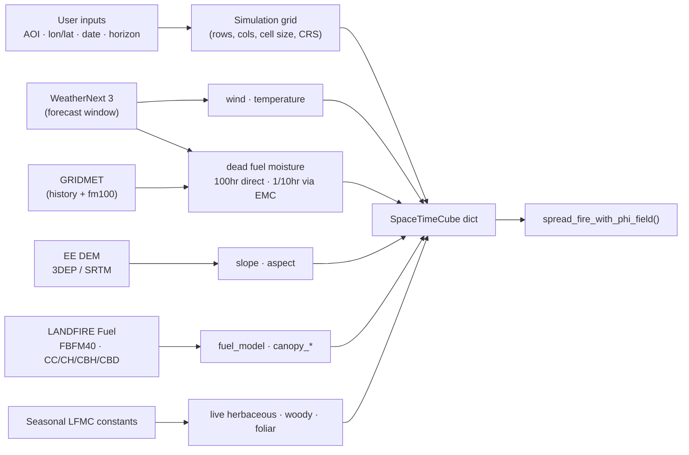

# Fire-Spread Simulation with `pyretechnics` + WeatherNext 3 — Input Requirements & Gap Analysis

> Goal: let a user pick **(1)** an Area of Interest, **(2)** an ignition point (lon/lat),
> **(3)** an ignition date, and **(4)** a projection horizon (days), then retrieve the data
> needed to initialize and run the `pyretechnics` engine over the period of interest.
>
> This document catalogs **everything the model requires** and specifies the **concrete source**
> for every input (WeatherNext 3, GRIDMET, an Earth Engine DEM, LANDFIRE, or user input).
> It reflects the **MVP** procurement choices; implementation is out of scope here.
>
> **Geographic scope: United States.** Sources assume a US Area of Interest, where LANDFIRE
> provides complete fuels/canopy layers and GRIDMET provides fire-danger fuel moisture.

---

## 1. How `pyretechnics` consumes data

`pyretechnics` does **not** fetch data itself. You build a Python `dict` of named
`SpaceTimeCube` objects (2D static layers or 3D space-time layers), plus a few scalar
config values, and pass them to the spread engine:

```python
fire_spread_results = els.spread_fire_with_phi_field(
    space_time_cubes,      # dict[str, ISpaceTimeCube]  <-- ALL model inputs
    spread_state,          # SpreadState(cube_shape).ignite_cell((y, x))
    cube_resolution,       # (band_duration_min, cell_height_m, cell_width_m)
    start_time,            # minutes from cube t=0
    max_duration,          # minutes
    spot_config=...,       # optional (spotting/firebrands)
    cube_refresh_rates=...,# optional (how often each weather layer updates)
)
```

Every layer must be aligned onto a common **space-time cube** (`t, y, x`). Layers may have
different native resolutions; the `SpaceTimeCube` wrapper upsamples them to a shared grid.
Source: `eulerian_level_set.py` (`make_SpreadInputs`, `SpreadInputs`, `spread_fire_with_phi_field`).

---

## 2. Complete list of required model inputs

### 2.1 Topography — **static (2D)**
| Cube key | Units | Notes |
|---|---|---|
| `slope` | rise/run (ratio) | Derived from a DEM |
| `aspect` | degrees clockwise from North | Derived from a DEM |

### 2.2 Fuels & vegetation structure — **static (2D)**
| Cube key | Units | Notes |
|---|---|---|
| `fuel_model` | integer index | Fuel model number (Scott & Burgan 40 / Anderson 13) |
| `canopy_cover` | 0–1 | Crown fire input |
| `canopy_height` | m | Crown fire input |
| `canopy_base_height` | m | Crown fire input |
| `canopy_bulk_density` | kg/m³ | Crown fire input |

### 2.3 Weather — **dynamic (3D, time-varying)**
| Cube key | Units | Notes |
|---|---|---|
| `wind_speed_10m` | km/hr | Magnitude of 10 m wind |
| `upwind_direction` | degrees clockwise from North | Direction the wind blows **FROM** |
| `temperature` | °C | **Optional** — only required if spotting is enabled |

### 2.4 Fuel moisture — **dynamic (3D, time-varying)**
| Cube key | Units | Notes |
|---|---|---|
| `fuel_moisture_dead_1hr` | kg moisture / kg ovendry | Dead fine fuels |
| `fuel_moisture_dead_10hr` | kg/kg | |
| `fuel_moisture_dead_100hr` | kg/kg | |
| `fuel_moisture_live_herbaceous` | kg/kg | |
| `fuel_moisture_live_woody` | kg/kg | |
| `foliar_moisture` | kg/kg | Canopy foliar moisture (crown fire) |

### 2.5 Optional spread adjustments
| Cube key | Units | Default |
|---|---|---|
| `fuel_spread_adjustment` | ≥ 0.0 | 1.0 |
| `weather_spread_adjustment` | ≥ 0.0 | 1.0 |

### 2.6 Scalar configuration (not cubes)
| Item | Units | Comes from user input |
|---|---|---|
| `cube_resolution` = (band_duration, cell_height, cell_width) | (min, m, m) | AOI + chosen grid resolution |
| grid shape `(bands, rows, cols)` | count | AOI extent + resolution + horizon |
| `start_time` | minutes from t=0 | Ignition **date** |
| `max_duration` | minutes | Projection **period (days)** |
| ignition cell `(y, x)` | grid index | Ignition **lon/lat** reprojected to grid |
| `spot_config` | dict | Optional firebrand/spotting parameters |

---

## 3. Mapping the 4 user inputs to the engine

| User input | Used for |
|---|---|
| **(1) Area of Interest** | Defines the bounding box → grid `(rows, cols)`, `cell_height/width`, CRS. All static & dynamic layers are clipped/resampled to it. |
| **(2) Ignition point (lon/lat)** | Reprojected into the AOI grid → `(y, x)` ignition cell (`SpreadState.ignite_cell`). |
| **(3) Ignition date** | Sets `start_time` and the t=0 origin of the weather/moisture cubes. |
| **(4) Projection period (days)** | Sets `max_duration` and the number of temporal bands to retrieve/build. |

---

## 4. WeatherNext 3 — what it provides

WeatherNext 3 (Google, served via Earth Engine / BigQuery / Zarr) surface product highlights:

- **Resolution:** ~0.1° gridded surface variables (finer station-calibrated 0.05°; 0.25° pressure levels).
- **Horizon:** up to **15 days (360 h)**, **hourly** time steps (no temporal interpolation).
- **Cadence:** initializations up to 24×/day.
- **Ensemble** members available.

**Available variable layers (surface):**
- `2m temperature`, `2m dew point`
- `10m` and `100m` wind (U/V components)
- Solar radiation (downward & direct)
- Precipitation (analysis precip, IMERG 1 h, experimental satellite-radar 1 h)
- Station-calibrated 2 m temperature & dew point (0.05°)

**Pressure-level layers (0.25°, 6-hourly):** geopotential, temperature, humidity, U/V wind,
vertical velocity across 13 levels (50–1000 hPa).

---

## 5. Coverage matrix — how each model input can be obtained

Each `pyretechnics` input is classified into one of three procurement statuses, with the
**concrete source** named (WeatherNext 3, an Earth Engine catalog dataset, etc.):

- 🟢 **Direct** — read almost as-is from a single named source (only unit conversion / clipping).
- 🟡 **Processed** — obtainable, but requires a documented calculation/derivation from one or
  more named sources (doable with known methods).
- 🔴 **Missing / needs further investigation** — no reliable ready source even for the US;
  requires research or accepting a proxy/assumption.

> **MVP note:** where a layer has no ready gridded source, the MVP fills it with a defensible
> **seasonal constant** (marked 🟡 *MVP constant*) and flags it for a post-MVP upgrade.

| Model input | Status | Concrete source | How |
|---|---|---|---|
| `wind_speed_10m` | 🟢 Direct | **WeatherNext 3** (10 m U/V) | `sqrt(u10²+v10²)`, m/s → km/hr |
| `upwind_direction` | 🟢 Direct | **WeatherNext 3** (10 m U/V) | `atan2(u10,v10)` → "from" bearing, deg CW from N |
| `temperature` | 🟢 Direct | **WeatherNext 3** (2 m temperature) | K → °C |
| `slope` | 🟡 Processed | **EE DEM** — `USGS/SRTMGL1_003` (SRTM 30 m), `COPERNICUS/DEM/GLO30`, `NASA/NASADEM_HGT/001`, or `USGS/3DEP/10m` (US) | `ee.Terrain.slope(dem)` → rise/run |
| `aspect` | 🟡 Processed | **EE DEM** (same as slope) | `ee.Terrain.aspect(dem)` → deg CW from N |
| `fuel_moisture_dead_1hr` | 🟡 Processed | **GRIDMET** (`rmax`,`rmin`,`tmmx`,`tmmn`) / **WeatherNext 3** | EMC (Fosberg/NFDRS) → `1hr ≈ 1.03×EMC` |
| `fuel_moisture_dead_10hr` | 🟡 Processed | **GRIDMET** / **WeatherNext 3** (same) | EMC → `10hr ≈ 1.28×EMC` |
| `fuel_moisture_dead_100hr` | 🟢 Direct | **GRIDMET** `fm100` (`IDAHO_EPSCOR/GRIDMET`) | 100-hr dead fuel moisture band, read as-is |
| `canopy_cover` | 🟢 Direct | **LANDFIRE US CC** (Forest Canopy Cover, Fuel category) or `LANDFIRE/Vegetation/EVC` in EE | Rescale to 0–1 fraction |
| `canopy_height` | 🟢 Direct | **LANDFIRE US CH** (Forest Canopy Height, Fuel category) or `LANDFIRE/Vegetation/EVH` in EE | Read height in m |
| `fuel_model` | 🟢 Direct | **LANDFIRE US FBFM40** (Scott & Burgan 40) — Fuel category, ingest from LANDFIRE program | Read integer fuel-model code as-is |
| `fuel_moisture_live_herbaceous` | � MVP constant | Seasonal constant by fuel type (upgrade: NFMD / satellite LFMC) | Fixed % by season/fuel model |
| `fuel_moisture_live_woody` | 🟡 MVP constant | Seasonal constant by fuel type (upgrade: NFMD / satellite LFMC) | Fixed % by season/fuel model |
| `foliar_moisture` | 🟡 MVP constant | Seasonal constant ~100% (standard in FARSITE/FlamMap) | Fixed % |
| `canopy_base_height` | 🟢 Direct | **LANDFIRE US CBH** (Fuel category, external ingest) | Read in m |
| `canopy_bulk_density` | 🟢 Direct | **LANDFIRE US CBD** (Fuel category, external ingest) | Read in kg/m³ |

### 5.1 Relevant Earth Engine catalog datasets (confirmed)

| Purpose | Earth Engine asset ID(s) | Notes |
|---|---|---|
| Weather (forecast) | WeatherNext 3 (EE / BigQuery / Zarr) | wind, temperature; hourly, 15-day |
| Dead fuel moisture + weather (history) | `IDAHO_EPSCOR/GRIDMET` | `fm100` direct; `rmin/rmax/tmmn/tmmx` → EMC for `1hr/10hr`; CONUS 4 km daily, 1979→present |
| DEM (global) | `USGS/SRTMGL1_003`, `COPERNICUS/DEM/GLO30`, `NASA/NASADEM_HGT/001` | 30 m; feed `ee.Terrain.slope`/`aspect` |
| DEM (US, higher-res) | `USGS/3DEP/10m` | 10 m seamless CONUS |
| Vegetation type (US) | `LANDFIRE/Vegetation/EVT/v1_4_0` | Basis for fuel-model crosswalk |
| Vegetation cover (US) | `LANDFIRE/Vegetation/EVC/v1_4_0` | → `canopy_cover` |
| Vegetation height (US) | `LANDFIRE/Vegetation/EVH/v1_4_0` | → `canopy_height` |
| Canopy cover (global) | `UMD/hansen/global_forest_change_*`, `MODIS/061/MOD44B` | Tree-cover fraction proxy |
| Canopy height (global) | `users/nlang/ETH_GlobalCanopyHeight_2020_10m_v1`, `LARSE/GEDI/GEDI02_A_*` | GEDI/ETH canopy height |
| Land cover (global) | `ESA/WorldCover/v200` | Fallback basis for fuel-model crosswalk |

> **US scope — key EE gap:** This project targets the **US**, where LANDFIRE provides full,
> fire-ready coverage of **all** the fuels/canopy layers. However, the official Earth Engine
> LANDFIRE catalog only exposes the **Vegetation** and **Fire** categories — the **Fuel**
> category (`FBFM40`, `CC`, `CH`, `CBH`, `CBD`) is **not** in EE. These must be ingested from
> the LANDFIRE program directly (e.g., the LANDFIRE product download / `rasterio` load).
> They are not a data *gap* for the US — just an *out-of-Earth-Engine* fetch step.

---

## 6. What is clearly MISSING from WeatherNext 3

WeatherNext 3 covers the **atmospheric drivers** only. For a **US** run, the non-weather
layers are sourced as follows:

1. **Topography** (`slope`, `aspect`) → 🟡 computed from an EE DEM (`USGS/SRTMGL1_003`,
   `COPERNICUS/DEM/GLO30`, or `USGS/3DEP/10m`) via `ee.Terrain`.
2. **Fuels & canopy structure** (`fuel_model`, `canopy_cover`, `canopy_height`,
   `canopy_base_height`, `canopy_bulk_density`) → 🟢 fully covered by **LANDFIRE (US)**.
   Note the **Fuel** category is fetched from the LANDFIRE program directly (not in EE core).
3. **Dead fuel moisture** (`1hr/10hr/100hr`) → **GRIDMET** supplies `fm100` directly (🟢);
   `1hr`/`10hr` are 🟡 derived from equilibrium moisture content (EMC) using GRIDMET
   humidity/temperature (historical spin-up) and WeatherNext 3 (forecast window).
4. **Live fuel moisture** (`live_herbaceous`, `live_woody`, `foliar_moisture`) → **MVP** fills
   these with defensible **seasonal constants** by fuel type (foliar ~100%, as in
   FARSITE/FlamMap). Post-MVP upgrade: NFMD field observations or a satellite LFMC product.

### Important caveats
- **Forecast vs. history:** WeatherNext 3 is a *forecast* model (init + up to 15-day horizon).
  For the **historical spin-up** before the ignition date, use **GRIDMET** (CONUS, daily,
  1979→present) — which also supplies `fm100` directly — reserving WeatherNext 3 for the
  forward projection window.
- **Unit conversions required:** temperature K→°C, wind m/s→km/hr, wind vectors→speed+"from"
  direction, RH derived from dew point + temperature.
- **Resolution mismatch:** WeatherNext ~0.1° (~11 km) is far coarser than typical fuel/topo
  layers (10–30 m). `SpaceTimeCube` upsampling handles alignment, but the effective weather
  detail stays coarse — acceptable via `cube_refresh_rates`, but worth noting for realism.

---

## 7. Recommended data-source plan (summary)

| Category | Layers | Status | Suggested source |
|---|---|---|---|
| Weather | wind, temperature | 🟢 Direct | **WeatherNext 3** |
| Dead fuel moisture (100 hr) | 100 hr | 🟢 Direct | **GRIDMET** `fm100` |
| Dead fuel moisture (1/10 hr) | 1 hr, 10 hr | 🟡 Processed | **GRIDMET**/**WeatherNext 3** → EMC (Fosberg/NFDRS) |
| Topography | slope, aspect | 🟡 Processed | **EE DEM** (`USGS/SRTMGL1_003`, `COPERNICUS/DEM/GLO30`, `USGS/3DEP/10m`) → `ee.Terrain` |
| Fuel model | fuel_model | 🟢 Direct | **LANDFIRE US** FBFM40 (Fuel category, external fetch) |
| Canopy cover / height | canopy_cover, canopy_height | 🟢 Direct | **LANDFIRE US** CC/CH (or EE EVC/EVH) |
| Canopy fuel structure | canopy_base_height, canopy_bulk_density | 🟢 Direct | **LANDFIRE US** CBH/CBD (Fuel category, external fetch) |
| Live fuel moisture | herbaceous, woody, foliar | 🟡 MVP constant | Seasonal constant by fuel type (upgrade: NFMD / LFMC) |

**Bottom line (US MVP):** every model input now has a concrete source. WeatherNext 3 gives
**wind + temperature** (🟢); **GRIDMET** gives `fm100` (🟢) and drives EMC for `1/10 hr` (🟡);
an **EE DEM** gives topography (🟡); **LANDFIRE** covers all fuels/canopy layers (🟢); and
**live fuel moisture** is filled with **seasonal constants** for the MVP (🟡), flagged for a
future data-driven upgrade. No input is left unsourced.

---

## 8. Consolidated source catalog (MVP)

The single reference for everything needed to run one simulation: user inputs first, then the
data sources and the model inputs each one feeds.

### 8.1 User-provided inputs

| # | User input | Engine parameter(s) | Role |
|---|---|---|---|
| 1 | Area of Interest (bbox/polygon) | grid `(rows, cols)`, `cell_height/width`, CRS | Defines the simulation grid; clips/resamples all layers |
| 2 | Ignition point (lon/lat) | ignition cell `(y, x)` | `SpreadState.ignite_cell((y, x))` |
| 3 | Ignition date (UTC) | `start_time`, cube t=0 origin | Anchors weather/moisture time axis |
| 4 | Projection horizon (days) | `max_duration`, number of temporal bands | Length of the run |

### 8.2 Data sources → model inputs

| Source | Access | Native res / cadence | Coverage | Feeds model inputs |
|---|---|---|---|---|
| **WeatherNext 3** | EE / BigQuery / Zarr | ~0.1°, hourly, 15-day horizon | Global | `wind_speed_10m`, `upwind_direction`, `temperature`; forecast-window EMC for dead `1/10 hr` |
| **GRIDMET** `IDAHO_EPSCOR/GRIDMET` | Earth Engine | ~4 km, daily, 1979→present | CONUS | `fuel_moisture_dead_100hr` (`fm100`); `rmin/rmax/tmmn/tmmx` → EMC → dead `1/10 hr` (spin-up) |
| **DEM** `USGS/3DEP/10m` (US) or `USGS/SRTMGL1_003` / `COPERNICUS/DEM/GLO30` | Earth Engine | 10–30 m | US / global | `slope`, `aspect` via `ee.Terrain` |
| **LANDFIRE Fuel** (FBFM40, CC, CH, CBH, CBD) | LANDFIRE program (external, `rasterio`) | 30 m | US | `fuel_model`, `canopy_cover`, `canopy_height`, `canopy_base_height`, `canopy_bulk_density` |
| **Seasonal LFMC constants** | config table (in-repo) | — | — | `fuel_moisture_live_herbaceous`, `fuel_moisture_live_woody`, `foliar_moisture` |
| **Defaults** | constant | — | — | `fuel_spread_adjustment`, `weather_spread_adjustment` = 1.0 (optional) |

### 8.3 MVP data flow


